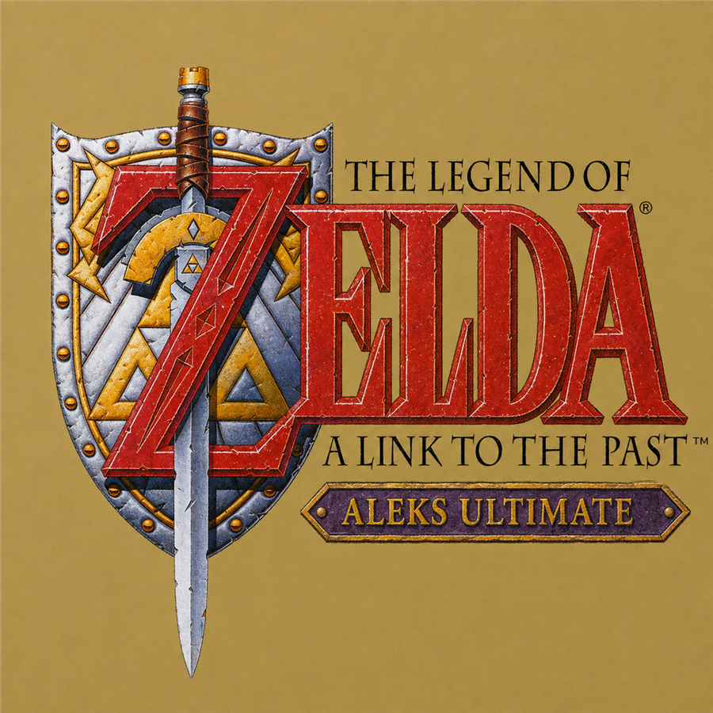
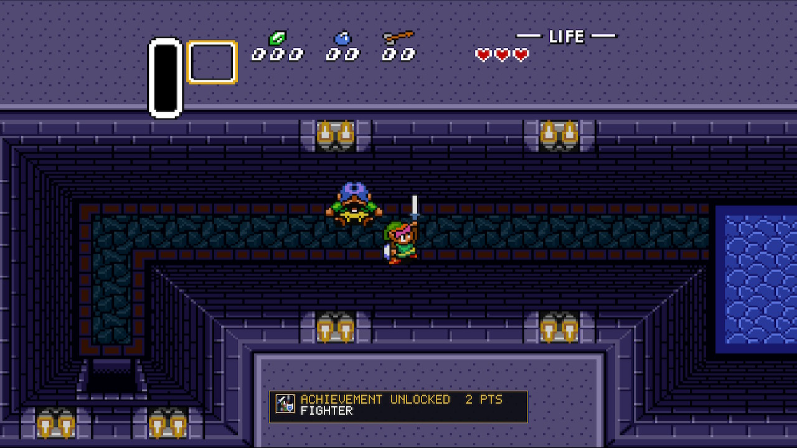
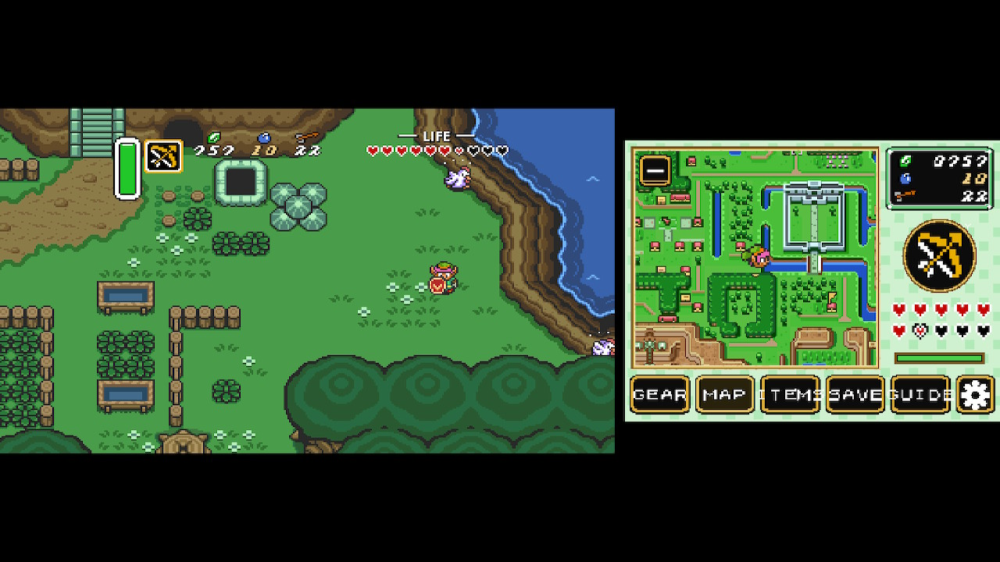
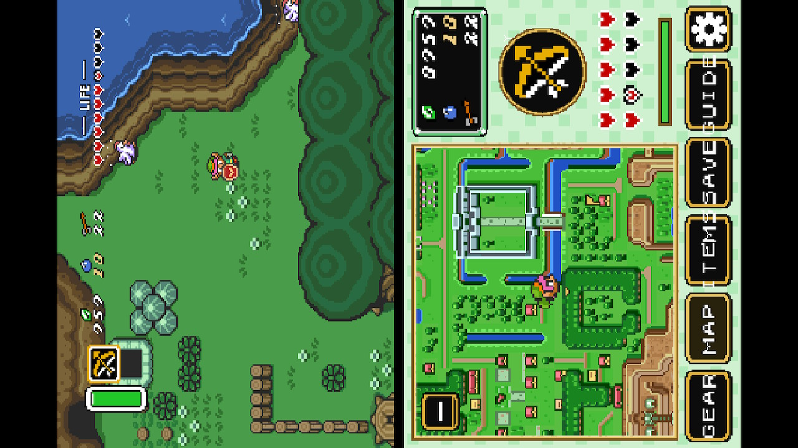
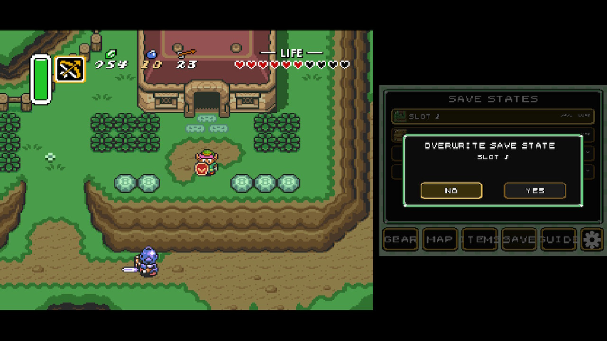
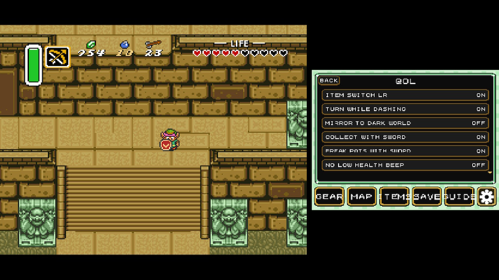
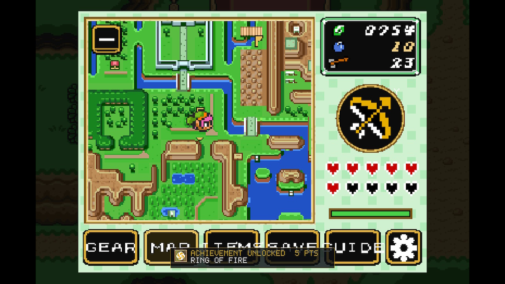
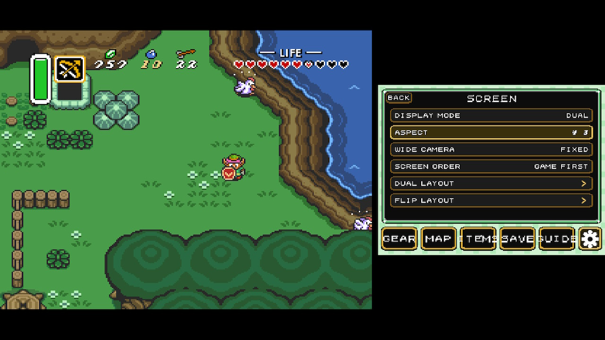
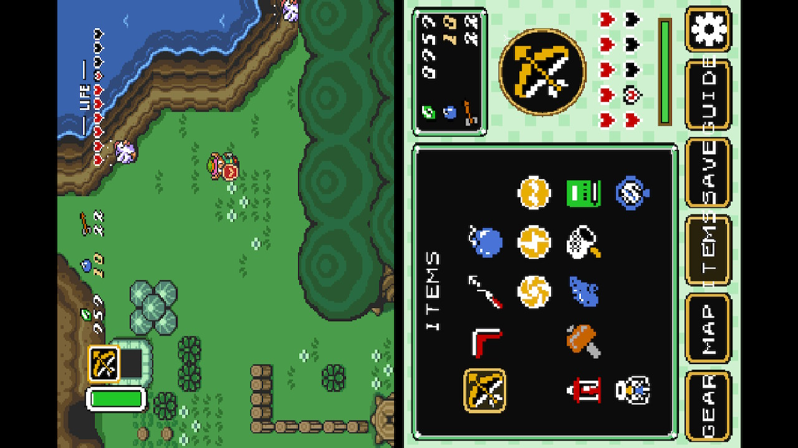
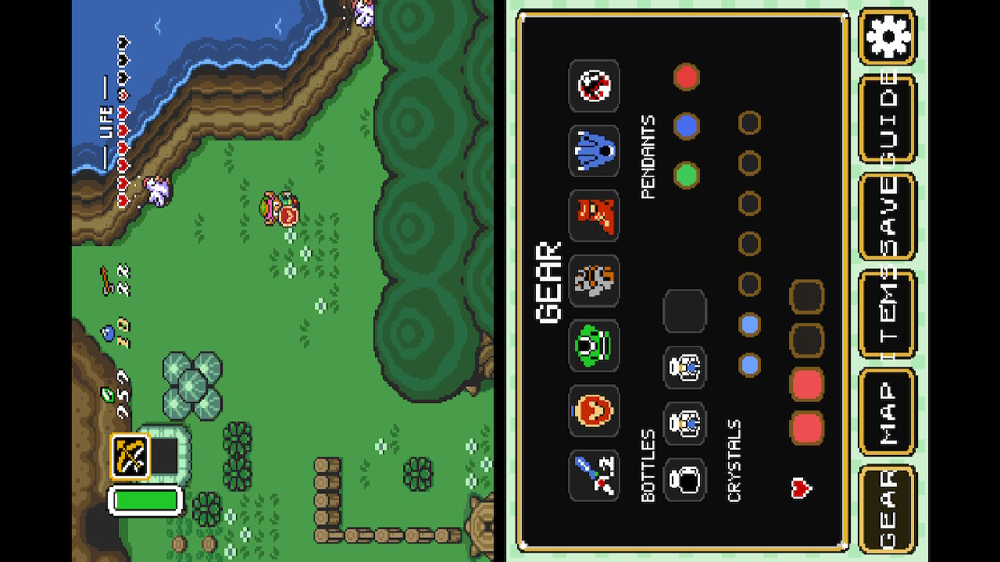

<div align="center">



# The Legend of Zelda: A Link to the Past — ALEKS Ultimate NX

**A modern Nintendo Switch experience for A Link to the Past, built on
[snesrev/zelda3](https://github.com/snesrev/zelda3).**

Expanded widescreen rendering, portable dual-screen layouts, quality-of-life
options and native Switch integration — including RetroAchievements.



</div>

---

## Highlights

| | |
|---|---|
| **True 16:9 / Expanded** | The engine renders more of the world natively — not a stretch and not a crop |
| **Dual Screen** | Gameplay and a companion interface side by side |
| **Flip Grip** | Vertical stacked layout for portrait play |
| **Companion screen** | Map, items, gear, save states and settings, by pad or touch |
| **RetroAchievements** | Login, identification, Rich Presence, unlocks and badges — hardware-tested |
| **Save States** | Slots with thumbnails, overwrite confirmation and a configurable quick slot |
| **Quick Items** | Use an item from a hotkey without changing what Y holds |
| **Multilanguage** | Extracts translated dialogue from a translation ROM you supply |

Everything is optional. With no ROM patches, no account and no network, this
plays as ordinary A Link to the Past.

---

## Screenshots

<table>
<tr>
<td width="50%"><br><sub><b>Dual Screen</b> — gameplay beside the companion map.</sub></td>
<td width="50%"><br><sub><b>Flip Grip</b> — the portrait canvas, shown here on a landscape panel.</sub></td>
</tr>
<tr>
<td><br><sub><b>Save States</b> — overwriting always asks first, and defaults to NO.</sub></td>
<td><br><sub><b>Quality of Life</b> — the engine's own optional fixes, individually switchable.</sub></td>
</tr>
<tr>
<td><br><sub><b>RetroAchievements</b> — a real unlock and badge on hardware.</sub></td>
<td><br><sub><b>Screen</b> — display mode, aspect and camera, changeable in play.</sub></td>
</tr>
<tr>
<td><br><sub><b>Items</b> — the inventory grid; select to equip.</sub></td>
<td><br><sub><b>Gear</b> — equipment, pendants, crystals and bottles.</sub></td>
</tr>
</table>

---

## Display & Presentation

### Aspect

Three aspects are offered, and all three are **native rendering**. The engine
draws a wider frame; nothing is stretched, letterboxed-and-zoomed, or cropped
to fake a shape.

| Aspect | Source frame | Displayed ratio | Notes |
|---|---|---|---|
| **4:3 Classic** | 256×224 | 1.333 | The original presentation, untouched |
| **True 16:9** | ~342×224 | 1.781 | More world horizontally; effectively fills a 16:9 panel |
| **True 16:9 Expanded** | ~366×240 | 1.779 | More world horizontally **and** vertically |

The ratios account for the SNES pixel aspect (7:6), which is why the numbers
are not simply `width / height`. Expanded uses the engine's 240-line mode, so
it also renders 16 extra lines of world.

> **On Expanded's vertical view.** The engine only draws world that exists.
> Where a room or area has nothing below the normal viewport, those extra lines
> have nothing to show and appear as a black band, which can come and go as the
> camera reaches an area's lower edge. **True 16:9 (342×224) has no such
> behaviour** and is the recommended default; Expanded is offered for players
> who want the maximum native view and can live with that.

A legacy 398×224 "Wide" mode still parses from older configuration files for
compatibility, but it is no longer selectable: after the pixel-aspect
correction it is 2.07:1, far wider than any Switch panel, so it can only be
shown with a thick letterbox.

### Camera

**Standard** keeps the vanilla camera. **Fixed** holds the camera off the area
bounds by the widescreen margin and interpolates across horizontal
transitions, so the extra columns do not snap at every screen edge. Fixed is
only meaningful when an expanded aspect is active.

### Display modes

| Mode | Description |
|---|---|
| **Normal** | Single-screen play. The companion opens as an overlay on demand. |
| **Dual** | Gameplay and the companion on screen together. |
| **Flip** | A vertical stack laid out on a 720×1280 design canvas and rotated onto the display, for Flip Grip-style portrait play. |

The 720×1280 canvas is a layout space only — the Switch display itself is
never reconfigured.

---

## Companion Screen

The companion is the portable second-screen interface, available in every
display mode. It is driven by pad or by touch.

- **Map** — light and dark world overworld maps, dungeon floors, and a live
  player marker. **R** toggles between following Link and the whole map.
- **Items** — the inventory grid; selecting an item equips it to Y.
- **Gear** — equipment, sword and shield progression, pendants, crystals and
  bottles.
- **Save States** — slots with thumbnails (see below).
- **Settings** — everything described in this document.

---

## Quality of Life

The engine's optional gameplay fixes, each individually switchable under
**Settings → Gameplay → QoL**, all off unless you turn them on:

`ITEM SWITCH LR` · `TURN WHILE DASHING` · `MIRROR TO DARK WORLD` ·
`COLLECT WITH SWORD` · `BREAK POTS WITH SWORD` · `NO LOW HEALTH BEEP` ·
`SKIP INTRO` · `MAX ITEMS IN YELLOW` · `MORE ACTIVE BOMBS` ·
`CARRY MORE RUPEES` · `MISC BUG FIXES` · `CANCEL BIRD TRAVEL`

`GAME CHANGING BUG FIXES` sits separately under Gameplay → Advanced.

### Hold to Advance

Holding the dialogue-advance button continues through ordinary dialogue pages
instead of requiring a tap for each one. Explicit choices — yes/no prompts and
item selectors — are deliberately excluded and always wait for you. Off by
default, because vanilla timing matters in some scripted scenes.

---

## Quick Items

Two configurable hotkeys that **use** an item rather than equipping it.

> Keep the Bow on Y and map Bombs to ZL. Pressing ZL places a Bomb, and the Bow
> is still on Y afterwards.

Quick Items run through the game's own item dispatcher, so ammunition, magic,
Link's state and every item-specific restriction apply exactly as they would
from Y. An item you do not own does nothing.

<details>
<summary>How this works</summary>

A Link to the Past already contains this mechanism: the X/L/R item-button
feature substitutes the item for one dispatch, tells the item code that Y was
pressed, and restores the input state afterwards — without ever writing the
equipped-item variable. Quick Items enter through that same path, which is why
multi-frame actions such as the Hookshot behave normally and why the HUD never
flickers. No item logic is reimplemented and no save memory is written
directly.

</details>

---

## Save States

A top-level companion page with one slot per card, each showing a thumbnail
and whether it is occupied.

- **X** — save to the selected slot. Always asks first, defaulting to **NO**.
- **Y** — load the selected slot immediately. Empty slots do nothing.
- **Quick Slot** — one slot chosen as the target for the Quick Save and Quick
  Load shortcuts. Quick Save asks for confirmation too, and will open the
  companion to do so if it is not already on screen.

Save states are **separate from the game's own save**. Zelda's SRAM remains
authoritative and untouched; states are a convenience layer beside it, and the
autosave slot is protected from being overwritten by them.

---

## RetroAchievements

RetroAchievements is integrated through the official
[rcheevos](https://github.com/RetroAchievements/rcheevos) client and is
**disabled by default**.

**Verified on real Switch hardware:** login, game identification, Rich
Presence, achievement evaluation, unlock submission, and the on-screen toast
with its badge.

- **Softcore only.** Achievements unlock and save states stay available.
- **Hardcore is not supported.** It is not offered and not claimed. Hardcore
  requires honouring the client's restrictions on save states and quick load,
  which has not been implemented or tested here — and unlocking hardcore
  achievements while save states still worked would be a false claim against
  your account.
- Only the RetroAchievements-issued session token is stored, never your
  password, and it lives in its own file rather than in the settings.
- No network, an unreachable server or a failed login never blocks the game.

---

## Multilanguage

Translated dialogue is extracted **locally, from a translation ROM you
supply**. No translated content is distributed with this project.

Place a compatible translated ROM in `languages/` and launch the game. Every
`.sfc`/`.smc` there is examined; a compatible one has its dialogue,
dictionary, font and character widths extracted into a small local pack, and
appears in **Settings → System → Language**.

**Compatibility is about ROM layout, not spoken language.** This has been
tested on real Switch hardware with **one** compatible Spanish translation
based on the US text layout. Other translations built the same way — including
ones nobody has catalogued, since the font and width table come from the ROM
itself — are expected to work, but each one is only proven when someone runs
it. Known incompatible categories:

- official PAL releases, which use a different base ROM and text encoding
- translation hacks that substantially remap the text or font system

An incompatible ROM is rejected cleanly and the game continues in English.
English always works, with or without a `languages/` directory.

Changing language takes effect on the next launch; the setting offers to
restart for you.

---

## Controls

Buttons are named as they are printed on the controller.

**Game**

| SNES | Switch | | SNES | Switch |
|---|---|---|---|---|
| B | A | | Select | – (Minus) |
| A | B | | Start | + (Plus) |
| X | X | | L | L |
| Y | Y | | R | R |
| D-Pad | D-Pad | | | |

All twelve are remappable in **Settings → Controls**.

**ALEKS chords** — held combinations, which always take priority over single-button actions.

| Chord | Action |
|---|---|
| ZR + L3 | Cycle display mode |
| ZL + L3 | Toggle the companion overlay |
| ZL + R3 | Open settings |
| ZL + ZR | Next companion page |

**Companion** — A confirms, B goes back. L / R change page. On the Map page,
R toggles follow/whole map. On Save States, X saves and Y loads.

**Shortcuts** — Companion, Settings, Next Page, Quick Save, Quick Load,
Display Mode and two Quick Items can each be assigned to a free control
(X, Y, ZL, ZR, L3, R3, Minus). A control already bound to a game command is
never offered, so a shortcut cannot fight gameplay input.

---

## Installation

You need a legally obtained **USA** copy of A Link to the Past. No ROM is
included here and none will be provided.

1. Copy the `.nro` to `sdmc:/switch/Zelda3/`.
2. Put your ROM in the same folder (`.sfc` or `.smc`).
3. Launch it.

On first run the built-in extractor finds your ROM, validates it, and
generates `zelda3_assets.dat` locally — on the console, with no Python or
other tooling required. A 512-byte copier header is handled where supported.

### Folder layout

```
sdmc:/switch/Zelda3/
├── Zelda3-ALEKS-NX.nro
├── zelda3.sfc            your ROM
├── zelda3_assets.dat     generated on first run
├── zelda3.ini            generated; all settings live here
├── saves/                SRAM and save states
├── languages/            optional translation ROMs and extracted packs
├── msu/                  optional MSU-1 audio
├── screenshots/
└── logs/                 diagnostics
```

Everything except the `.nro` and your ROM is created automatically.

---

## Hardware Validation

This project is developed against a real console, and this section says
plainly what that does and does not cover.

**Verified on real Switch hardware**

- Normal, Dual and Flip display modes
- Save states: save, load, thumbnails, overwrite confirmation
- RetroAchievements: login, identification, Rich Presence, a real unlock, and
  the toast with its badge
- Asset extraction from a user ROM
- Multilanguage extraction, with **one** compatible Spanish translation based
  on the US text layout: extraction, dialogue and accented characters

**Implemented and source-verified, awaiting broader hardware validation**

- True 16:9 Expanded (366×240)
- Hold to Advance
- Quick Items as quick *use*
- Docked 1920×1080 output
- Language switching round-trip

Anything not listed above should be treated as untested rather than assumed
working.

---

## Known Limitations

- RetroAchievements Hardcore is not supported.
- Language support depends on the translation ROM's layout, not its language.
- Changing language requires a restart.
- True 16:9 Expanded's extra vertical view depends on the current area having
  world below the normal viewport; where it does not, a black band appears.
- The companion's Guide page is a placeholder — no story guide content exists
  yet, and it is off by default.

---

## Project Lineage & Attribution

This is an integration project. Most of what makes it work was written by
other people, and the distinction between adapted code and referenced
technique is kept explicit below.

### [snesrev/zelda3](https://github.com/snesrev/zelda3)
**Base / upstream.** The reverse-engineered A Link to the Past engine: game
logic, PPU, renderer, save handling, the optional gameplay features exposed
here as QoL, and the widescreen and 240-line rendering paths this project
builds its aspect modes on.

### [EstebanPdN/zelda-alttp-3ds](https://github.com/EstebanPdN/zelda-alttp-3ds)
**Primary portable base / code adapted from — used with permission.**

This is the portable implementation ALEKS Ultimate NX was built from. Adapted
here: the second-screen companion interface — map, dungeon maps, items, gear,
the HUD panel and its art pipeline — the fixed widescreen camera, the
save-state slot model with thumbnails, and the translation extractor whose ROM
offsets, message walk, dictionary bounds and compatibility lists are
reproduced in this port.

**Portions of the portable Zelda3 implementation were adapted from
EstebanPdN/zelda-alttp-3ds with permission from EstebanPdN**, who described
the project as open code.

EstebanPdN's project is itself built on earlier Zelda3, Android and
dual-screen work — see below.

### [samyost1/zelda3-android](https://github.com/samyost1/zelda3-android)
**Upstream dual-screen lineage / feature foundation.**

Part of the dual-screen functionality present in EstebanPdN's port originated
from samyost1's Zelda3 Android dual-screen work.

ALEKS Ultimate NX primarily adapted the EstebanPdN implementation, but
samyost1 is credited because that work forms part of the technical lineage of
the second-screen system.

### ALEKS TMC (The Minish Cap, Switch)
**Platform implementation reference.** The proven Switch architecture this
port follows: the Normal/Dual/Flip compositor and layout model, the input and
touch transforms, the runtime settings and shortcut patterns, the crash
context and reporting design, and the RetroAchievements platform integration —
network lifecycle, token storage, unlock queue, badge worker and the
single-overlay toast stage — adapted here with a Zelda3-specific memory
adapter and identification.

### [rcheevos](https://github.com/RetroAchievements/rcheevos)
**Bundled dependency.** The official RetroAchievements client library.

### devkitPro / libnx / SDL2
**Toolchain and platform layer.**

### ALEKS Zelda3 NX / ALEKS Ultimate NX
**New Switch integration / ALEKS work.**

- Nintendo Switch compositor and the authoritative physical display-size
  resolution
- Normal / Dual / Flip integration on Switch, and the input-ownership model
  that decides when the companion owns the pad
- True 16:9 and True 16:9 Expanded, and the centralised aspect geometry every
  subsystem derives from
- Runtime aspect switching, including the transactional texture handling that
  made it safe
- Settings persistence, atomic configuration writes and the controls repair
- Save-state UX: the companion page, confirmations, quick slot and the slot
  mapping that protects the autosave
- Quick Items as quick *use*, routed through the game's native item dispatcher
- Zelda3-specific RetroAchievements integration: the SNES memory adapter,
  game identification and the single overlay stage the toast draws in
- On-console multilingual extraction and runtime language registration
- Crash diagnostics and the display journal

---

## Development & AI Assistance

This project was built through source analysis, implementation, on-console
testing and iterative debugging, with AI-assisted code analysis and
integration used throughout development.

That assistance does not change the attribution above: the upstream and donor
projects are credited on their own terms, and their authorship is not diluted
by how this integration was written. Where this document claims something was
validated on hardware, that means it was actually run on a console — the
[Hardware Validation](#hardware-validation) section distinguishes what has
been tested from what has not.

---

## Building From Source

Requires **devkitPro** with **devkitA64**, **libnx** and **switch-sdl2**, plus
`switch-libpng`, `switch-curl` and `switch-mbedtls` for the RetroAchievements
build.

```sh
cd src/platform/switch
make
```

The build must run from a devkitPro MSYS2 shell. Note that a source path
containing spaces will break the build — check out this repository somewhere
without them.

---

## Legal

- **No ROM is included**, and no Nintendo-owned game data is present in this
  repository or in any release.
- You must supply your own legally obtained copy of the game. Assets generated
  from it — including any extracted translation data — stay on your own
  installation and are never distributed.
- *The Legend of Zelda*, *A Link to the Past* and related trademarks belong to
  Nintendo.
- This project is not affiliated with, authorised by or endorsed by Nintendo.

---

## License

**Upstream engine — MIT.** The Zelda3 code this is built on is MIT
(© 2022 snesrev, © 2021 elzo_d), see [LICENSE.txt](LICENSE.txt). New code
written for this project is released under the same terms.

**Bundled dependencies**, each under its own license:

| Component | License |
|---|---|
| [rcheevos](third_party/rcheevos/LICENSE) | MIT © RetroAchievements.org |
| stb | Public domain / MIT |
| Opus | BSD |
| gl_core | Generated loader, per its own terms |

### Portable / companion-screen code

The companion interface did not come from upstream. It was adapted from
**EstebanPdN/zelda-alttp-3ds**, whose author gave permission for its use and
described the project as open code. The files concerned:

| File | Origin |
|---|---|
| `src/second_screen.c` | adapted from EstebanPdN's port |
| `src/second_screen_sdl.c` | adapted from EstebanPdN's port |
| `src/second_screen_tables.h` | adapted from EstebanPdN's port |
| `src/ss_sheets.h`, `src/ss_textures.h` | UI art and tables from the same port |
| `src/wide_camera.c`, `src/wide_camera.h` | EstebanPdN (fixed widescreen camera) |
| translation extraction in `src/aleks_lang.c` | ported from EstebanPdN's `TranslationExtractor.java` |

Part of the dual-screen functionality in that port originated from
**samyost1/zelda3-android**, credited above as part of the second-screen
lineage.

Neither donor repository declares an explicit license, so **this project makes
no license claim on their original contributions** and does not present them
as MIT. Permission from EstebanPdN covers his own work; it does not, and is
not presented to, relicense samyost1's original contributions. Attribution
does not alter anyone's copyright, and none is implied here.

If you are EstebanPdN or samyost1 and want different wording, different terms,
or a license statement of your own reflected here, please open an issue and it
will be honoured.

None of these files contain Nintendo-owned data: `ss_textures.h` holds the
port's own UI theme graphics, not game art.

Full notices: [THIRD-PARTY-NOTICES.md](THIRD-PARTY-NOTICES.md).

---

<div align="center">
<sub>Built on the work of snesrev, EstebanPdN, samyost1 and the
RetroAchievements project.</sub>
</div>
